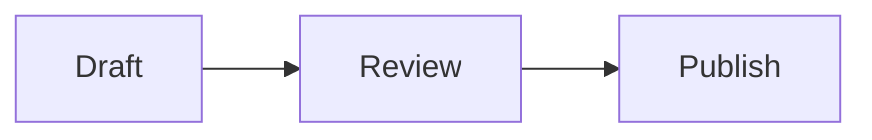

# Markdown Flow

<p align="center">
  
</p>

<p align="center">
  <strong>Beautiful, interactive Markdown for React.</strong><br />
  A production-ready document toolkit that turns familiar Markdown into calm, expressive interfaces—with charts, structured blocks, diagrams, math, code, and media, without inventing a new authoring format.
</p>

<p align="center">
  <a href="#quick-start">Quick start</a> ·
  <a href="#what-it-renders">Formats</a> ·
  <a href="#whats-new-in-012">What’s new</a> ·
  <a href="#api">API</a> ·
  <a href="#safety-and-content-model">Safety</a> ·
  <a href="#quality-and-compatibility">Quality</a> ·
  <a href="#playground-and-examples">Playground</a>
</p>

<p align="center">
  <a href="https://www.npmjs.com/package/markdown-flow"></a>
  <a href="https://www.npmjs.com/package/markdown-flow"></a>
  <a href="https://github.com/hrisheesh/markdown-flow/actions/workflows/package-quality.yml"></a>
  <a href="https://github.com/hrisheesh/markdown-flow"></a>
  <a href="https://github.com/hrisheesh/markdown-flow"></a>
</p>

## Why Markdown Flow?

Markdown is a great writing interface. Markdown Flow keeps it that way, then adds a small vocabulary of rich fenced blocks for the moments a paragraph is not enough.

- **Drop-in React component** — render a string with one component and one stylesheet.
- **A polished reading experience** — premium typography, responsive layout, restrained motion, accessible controls, and reduced-motion support are included.
- **Rich without a new DSL** — write JSON5 in standard fenced Markdown blocks; easy for people, LLMs, and version control.
- **Safer by default** — rendered HTML is sanitized and external resources are represented as safe previews instead of executable embeds.
- **Framework-friendly** — works in React, Vite, and Next.js client components. No Next.js runtime dependency.

## Built for real applications

| Use it with | What you get |
| --- | --- |
| **React 18+** | A typed `RichMarkdown` component with ESM, CommonJS, and declaration exports. |
| **Next.js** | Client-component friendly rendering; import the stylesheet once in your root layout. |
| **Any CSS setup** | A precompiled stylesheet with renderer rules scoped under `.markdown-render`; no Tailwind setup is required. |
| **User-authored or generated content** | Sanitized Markdown, defensive rich-block parsing, and non-executable link previews. |

## Installation

```bash
npm install markdown-flow
```

## What’s new in 0.1.2

`0.1.2` launches Markdown Flow as a clean, unscoped package name and makes the renderer more adaptable and dependable. The complete experience stays at the package root:

```tsx
import { RichMarkdown } from "markdown-flow";
```

- **Controlled extension points** — add per-render fenced-block renderers with `blockRenderers`, or override standard Markdown elements through `components`.
- **More resilient framework paths** — use the optional `markdown-flow/core` entry for Markdown-only experiences, or `markdown-flow/server` for static server rendering. These are additive choices; the root renderer remains the complete experience.
- **Better interactive semantics** — citations, accordions, tabs, progress indicators, and charts now expose clearer accessible labels, state, and relationships.
- **Release-grade safeguards** — render contracts, React 18/19 packed-package compatibility tests, size budgets, and CI protect the published surface.


### Migrating from the scoped package

The earlier `@hrisheesh/markdown-render@0.1.1` release remains available, but all new installs should use `markdown-flow`. Update the package name in imports and stylesheet paths; component APIs and Markdown content remain the same.

## Quick start

Import the stylesheet once at your application entry point, then pass Markdown to `RichMarkdown`.

```tsx
import { RichMarkdown } from "markdown-flow";
import "markdown-flow/styles.css";

const content = `
# Your document

Markdown Flow turns **Markdown** into a finished reading experience.

> Use ordinary Markdown wherever it is the clearest tool.
`;

export function DocumentPreview() {
  return <RichMarkdown content={content} />;
}
```

### Stream an AI response

Use the client-only AI entry point to keep completed Markdown sections stable while text is arriving. Fenced rich blocks remain pending until their closing fence is received, so incomplete JSON never reaches an interactive renderer.

```tsx
import { StreamingRichMarkdown, useMarkdownFlowStream } from "markdown-flow/ai";
import "markdown-flow/styles.css";

function AssistantAnswer() {
  const stream = useMarkdownFlowStream();

  // In an SSE or provider callback:
  // stream.append(delta);
  // stream.complete();

  return <StreamingRichMarkdown stream={stream} renderPolicy={{ allowedBlocks: ["callout", "chart"] }} />;
}
```

`useMarkdownFlowStream()` also accepts provider-neutral text, citation, dataset, error, and complete events through `stream.apply(event)`. It exposes `append`, `replace`, `complete`, `fail`, `cancel`, and `retry` controls. Use the hook for incremental streaming; for a simple accumulated string, pass `content` directly to `StreamingRichMarkdown`.

### Lean Markdown-only entry

When an experience only needs responsive, sanitized GitHub-flavored Markdown, use the dedicated core entry. It excludes rich blocks, charts, Mermaid, KaTeX, and syntax highlighting from the imported runtime while leaving the default package behavior unchanged.

```tsx
import { RichMarkdownCore } from "markdown-flow/core";
import "markdown-flow/core.css";

export function Article({ content }: { content: string }) {
  return <RichMarkdownCore content={content} />;
}
```

### Next.js (App Router)

Import the stylesheet in your root layout and render the interactive component from a Client Component.

```tsx
// app/layout.tsx
import "markdown-flow/styles.css";
```

```tsx
// components/document-preview.tsx
"use client";

import { RichMarkdown } from "markdown-flow";

export function DocumentPreview({ content }: { content: string }) {
  return <RichMarkdown content={content} />;
}
```

### Server Components and SSR

For non-interactive documents, use the static entry directly in a React Server Component or any server-rendered React application. It supports sanitized GitHub-flavored Markdown and element overrides, but intentionally does not load interactive rich blocks, Mermaid, math, or syntax highlighting.

```tsx
// app/article/page.tsx — no "use client" needed
import { StaticMarkdown } from "markdown-flow/server";
import "markdown-flow/core.css";

export default async function ArticlePage() {
  const content = "# Server-rendered Markdown";
  return <StaticMarkdown content={content} />;
}
```

## What it renders

| Native Markdown | Rich document blocks | Data and technical content |
| --- | --- | --- |
| Headings, lists, links, images, tables, task lists, blockquotes, code | Callouts, metrics, timelines, steps, comparisons, cards, tabs, accordions, quotes, status, progress, checklists, file trees | Charts, Mermaid diagrams, KaTeX math, syntax-highlighted code, safe embeds, image galleries, before/after layouts, map summaries |

Rich blocks use a fenced code block with a JSON5 configuration. Your source stays readable and portable.

### Callouts

````md
```callout
{
  tone: "insight",
  title: "Start with the reader",
  body: "Use a richer block only when it makes an idea quicker to understand."
}
```
````

### Metrics

````md
```metrics
{
  title: "This week",
  metrics: [
    { label: "Active users", value: "24.8K", change: "+12.4%", detail: "vs last week" },
    { label: "Conversion", value: "6.2%", change: "+0.8%", detail: "vs last week" }
  ]
}
```
````

### Charts

````md
```chart
{
  type: "area",
  title: "Weekly momentum",
  data: [
    { name: "Mon", value: 18 },
    { name: "Tue", value: 24 },
    { name: "Wed", value: 21 },
    { name: "Thu", value: 38 },
    { name: "Fri", value: 46 }
  ],
  keys: ["value"]
}
```
````

Supported chart types: `bar`, `line`, `area`, `pie`, `radar`, `composed`, `sparkline`, `scatter`, `funnel`, `gauge`, `heatmap`, `cohort`, and `waterfall`.

### Diagrams and math

Mermaid and KaTeX work alongside your rich blocks.

````md


The familiar equation $E = mc^2$ works inline, too.
````

## API

```ts
import type {
  Citation,
  RichBlockRenderers,
  RichMarkdownProps,
} from "markdown-flow";
```

| Prop | Type | Description |
| --- | --- | --- |
| `content` | `string` | Markdown source, including optional rich fenced blocks. |
| `citations` | `Citation[]` | Optional source references displayed as interactive inline citation badges. |
| `blockRenderers` | `RichBlockRenderers` | Explicit renderers for named fenced block languages. |
| `components` | `Components` | Overrides for standard Markdown HTML elements. |

```tsx
<RichMarkdown
  content="Research supports this conclusion [1]."
  citations={[
    {
      id: "[1]",
      chunk_id: "chunk-001",
      document_id: "research-2026",
      filename: "research-summary.pdf",
      text_preview: "The supporting source excerpt appears here.",
    },
  ]}
/>
```

### Controlled extension points

Register custom fenced blocks per render. There is no global registry, so configurations stay isolated between requests and documents. A renderer receives text-only fenced content after Markdown sanitization; return ordinary React elements and avoid `dangerouslySetInnerHTML` for untrusted content.

```tsx
import { RichMarkdown, type RichBlockRenderers } from "markdown-flow";

const blockRenderers: RichBlockRenderers = {
  alert: ({ code }) => <aside role="note">{code}</aside>,
};

export function ReleaseNotes({ content }: { content: string }) {
  return (
    <RichMarkdown
      content={content} // ```alert\nScheduled maintenance tonight.\n```
      blockRenderers={blockRenderers}
      components={{ h2: ({ children }) => <h2 className="section-title">{children}</h2> }}
    />
  );
}
```

`components` is also available on `RichMarkdownCore` and `StaticMarkdown`. Overrides are applied after the package defaults, while Markdown source is still sanitized before any override receives it.

## Styling

The package ships its compiled renderer styles and does not require a Tailwind configuration in your application. Component-specific rules are scoped to `.markdown-render`; import the stylesheet once where global styles are allowed:

```ts
import "markdown-flow/styles.css";
```

The component is responsive by default. It respects a visitor's `prefers-reduced-motion` setting and keeps wide tables, diagrams, and math readable on small screens.

## Package contents

The npm tarball intentionally contains only the distributable library, its generated type declarations, compiled styles, and KaTeX fonts required for mathematical notation. It does not ship the Next.js playground, source files, development tooling, or repository-only assets.

## Quality and compatibility

The published package has focused safeguards for the parts most likely to regress in a renderer:

- **Accessibility contracts** cover semantic labels and state for charts, citations, tabs, accordions, and progress indicators.
- **Render regression checks** verify sanitization, component overrides, custom blocks, core rendering, and the server entry against representative Markdown.
- **React compatibility** installs the packed tarball in clean React 18 and React 19 consumers, then server-renders both the interactive and static entries.
- **Package-size budgets** fail when the public JavaScript or CSS entry points grow beyond their approved limits.
- **CI** runs these checks plus linting and publish-content verification on pull requests and `main` updates.

Run the complete local quality suite after building a change:

```bash
npm test
npm run test:compat
npm pack --dry-run
```

`test:compat` intentionally performs temporary npm installs for React 18 and React 19. It never changes this repository or publishes a package.

### 0.1.1 → 0.1.2 controlled stress test

The following local release comparison used the published `0.1.1` package and the packed `0.1.2` candidate in the same isolated React 19.2.4 SSR environment. Each timing alternated package order across six rounds to reduce warm-up bias. Results are directional rather than a guarantee for every application.

| Scenario | Workload | 0.1.1 | 0.1.2 | Change |
| --- | --- | ---: | ---: | ---: |
| Small Markdown | 3,000 renders × 6 rounds | 6,319 renders/s | 6,641 renders/s | 4.8% faster |
| Rich blocks | 1,500 renders × 6 rounds | 5,191 renders/s | 5,154 renders/s | 0.7% slower* |
| Large document | 9,731-character source → 89,104-character HTML | 56.9 renders/s | 60.9 renders/s | 6.6% faster |

\*The rich-block difference is within normal benchmark noise; the default root renderer remains effectively performance-neutral in this comparison.

The additional release safeguards have a deliberately small distribution impact: root ESM is **+1.4 kB**, root CJS is **+1.5 kB**, root CSS is **+348 B**, and the npm tarball is **+17.2 kB (1.9%)**. For consumers that intentionally need only sanitized GitHub-flavored Markdown, the optional `core` entry is about **5.7 kB ESM including its shared chunk**, compared with about **67.7 kB** for the full root entry.

## Safety and content model

- GitHub-flavored Markdown and mathematical notation are supported.
- Rendered Markdown is sanitized before output.
- Custom block renderers receive text-only fenced content; they do not bypass sanitization.
- Rich block configuration is parsed defensively; malformed configuration degrades gracefully.
- Link previews are informational cards, not third-party page embeds.

If you render content from untrusted users, continue to apply your usual product-level moderation, authorization, and data-handling rules.

## Playground and examples

The repository contains a complete live playground and examples for every format:

```bash
git clone https://github.com/hrisheesh/markdown-flow.git
cd markdown-flow
npm install
npm run dev
```

Open [http://localhost:3000](http://localhost:3000) to explore, edit, and copy rich-block source.

Small copy-ready starting points are also included in the repository:

- [`examples/react-vite.tsx`](examples/react-vite.tsx) — standard React/Vite client rendering.
- [`examples/next-app-router.tsx`](examples/next-app-router.tsx) — static Markdown in a Next.js App Router Server Component.

## Repository quality

Every pull request and update to `main` verifies linting, library compilation, render contracts, accessibility semantics, React peer compatibility, size budgets, and the exact contents that npm would publish.

## License

This package is currently published without a declared open-source license. Contact the repository owner before redistributing or using it beyond evaluation.
