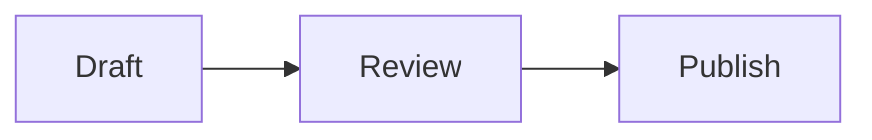

# Markdown Render

<p align="center">
  
</p>

<p align="center">
  <strong>Beautiful, interactive Markdown for React.</strong><br />
  A production-ready document renderer that turns familiar Markdown into calm, expressive interfaces—with charts, structured blocks, diagrams, math, code, and media, without inventing a new authoring format.
</p>

<p align="center">
  <a href="#quick-start">Quick start</a> ·
  <a href="#what-it-renders">Formats</a> ·
  <a href="#api">API</a> ·
  <a href="#safety-and-content-model">Safety</a> ·
  <a href="#playground-and-examples">Playground</a>
</p>

<p align="center">
  <a href="https://www.npmjs.com/package/@hrisheesh/markdown-render"></a>
  <a href="https://www.npmjs.com/package/@hrisheesh/markdown-render"></a>
  <a href="https://github.com/hrisheesh/markdownrender/actions/workflows/package-quality.yml"></a>
  <a href="https://github.com/hrisheesh/markdownrender"></a>
  <a href="https://github.com/hrisheesh/markdownrender"></a>
</p>

## Why Markdown Render?

Markdown is a great writing interface. Markdown Render keeps it that way, then adds a small vocabulary of rich fenced blocks for the moments a paragraph is not enough.

- **Drop-in React component** — render a string with one component and one stylesheet.
- **A polished reading experience** — premium typography, responsive layout, restrained motion, accessible controls, and reduced-motion support are included.
- **Rich without a new DSL** — write JSON5 in standard fenced Markdown blocks; easy for people, LLMs, and version control.
- **Safer by default** — rendered HTML is sanitized and external resources are represented as safe previews instead of executable embeds.
- **Framework-friendly** — works in React, Vite, and Next.js client components. No Next.js runtime dependency.

## Built for real applications

| Use it with | What you get |
| --- | --- |
| **React 18+** | A typed `RichMarkdown` component with ESM, CommonJS, and declaration exports. |
| **Next.js** | Client-component friendly rendering; import the stylesheet once in your root layout. |
| **Any CSS setup** | A precompiled stylesheet with renderer rules scoped under `.markdown-render`; no Tailwind setup is required. |
| **User-authored or generated content** | Sanitized Markdown, defensive rich-block parsing, and non-executable link previews. |

## Installation

```bash
npm install @hrisheesh/markdown-render
```

## Quick start

Import the stylesheet once at your application entry point, then pass Markdown to `RichMarkdown`.

```tsx
import { RichMarkdown } from "@hrisheesh/markdown-render";
import "@hrisheesh/markdown-render/styles.css";

const content = `
# Your document

Markdown Render turns **Markdown** into a finished reading experience.

> Use ordinary Markdown wherever it is the clearest tool.
`;

export function DocumentPreview() {
  return <RichMarkdown content={content} />;
}
```

### Next.js (App Router)

Import the stylesheet in your root layout and render the interactive component from a Client Component.

```tsx
// app/layout.tsx
import "@hrisheesh/markdown-render/styles.css";
```

```tsx
// components/document-preview.tsx
"use client";

import { RichMarkdown } from "@hrisheesh/markdown-render";

export function DocumentPreview({ content }: { content: string }) {
  return <RichMarkdown content={content} />;
}
```

## What it renders

| Native Markdown | Rich document blocks | Data and technical content |
| --- | --- | --- |
| Headings, lists, links, images, tables, task lists, blockquotes, code | Callouts, metrics, timelines, steps, comparisons, cards, tabs, accordions, quotes, status, progress, checklists, file trees | Charts, Mermaid diagrams, KaTeX math, syntax-highlighted code, safe embeds, image galleries, before/after layouts, map summaries |

Rich blocks use a fenced code block with a JSON5 configuration. Your source stays readable and portable.

### Callouts

````md
```callout
{
  tone: "insight",
  title: "Start with the reader",
  body: "Use a richer block only when it makes an idea quicker to understand."
}
```
````

### Metrics

````md
```metrics
{
  title: "This week",
  metrics: [
    { label: "Active users", value: "24.8K", change: "+12.4%", detail: "vs last week" },
    { label: "Conversion", value: "6.2%", change: "+0.8%", detail: "vs last week" }
  ]
}
```
````

### Charts

````md
```chart
{
  type: "area",
  title: "Weekly momentum",
  data: [
    { name: "Mon", value: 18 },
    { name: "Tue", value: 24 },
    { name: "Wed", value: 21 },
    { name: "Thu", value: 38 },
    { name: "Fri", value: 46 }
  ],
  keys: ["value"]
}
```
````

Supported chart types: `bar`, `line`, `area`, `pie`, `radar`, `composed`, `sparkline`, `scatter`, `funnel`, `gauge`, `heatmap`, `cohort`, and `waterfall`.

### Diagrams and math

Mermaid and KaTeX work alongside your rich blocks.

````md


The familiar equation $E = mc^2$ works inline, too.
````

## API

```ts
import type { Citation, RichMarkdownProps } from "@hrisheesh/markdown-render";
```

| Prop | Type | Description |
| --- | --- | --- |
| `content` | `string` | Markdown source, including optional rich fenced blocks. |
| `citations` | `Citation[]` | Optional source references displayed as interactive inline citation badges. |

```tsx
<RichMarkdown
  content="Research supports this conclusion [1]."
  citations={[
    {
      id: "[1]",
      chunk_id: "chunk-001",
      document_id: "research-2026",
      filename: "research-summary.pdf",
      text_preview: "The supporting source excerpt appears here.",
    },
  ]}
/>
```

## Styling

The package ships its compiled renderer styles and does not require a Tailwind configuration in your application. Component-specific rules are scoped to `.markdown-render`; import the stylesheet once where global styles are allowed:

```ts
import "@hrisheesh/markdown-render/styles.css";
```

The component is responsive by default. It respects a visitor's `prefers-reduced-motion` setting and keeps wide tables, diagrams, and math readable on small screens.

## Package contents

The npm tarball intentionally contains only the distributable library, its generated type declarations, compiled styles, and KaTeX fonts required for mathematical notation. It does not ship the Next.js playground, source files, development tooling, or repository-only assets.

## Safety and content model

- GitHub-flavored Markdown and mathematical notation are supported.
- Rendered Markdown is sanitized before output.
- Rich block configuration is parsed defensively; malformed configuration degrades gracefully.
- Link previews are informational cards, not third-party page embeds.

If you render content from untrusted users, continue to apply your usual product-level moderation, authorization, and data-handling rules.

## Playground and examples

The repository contains a complete live playground and examples for every format:

```bash
git clone https://github.com/hrisheesh/markdownrender.git
cd markdownrender
npm install
npm run dev
```

Open [http://localhost:3000](http://localhost:3000) to explore, edit, and copy rich-block source.

## Repository quality

Every pull request and update to `main` verifies linting, library compilation, and the exact contents that npm would publish. The repository also includes focused bug and feature request forms so package feedback arrives with the context needed to act on it.

## Contributing

Keep changes focused, test the corresponding playground state, and run the package checks before opening a pull request:

```bash
npm run lint
npm run build:package
npm pack --dry-run
```

New rich blocks should be content-first, responsive, keyboard-accessible where interactive, motion-conscious, and resilient to malformed configuration.

## License

This package is currently published without a declared open-source license. Contact the repository owner before redistributing or using it beyond evaluation.
